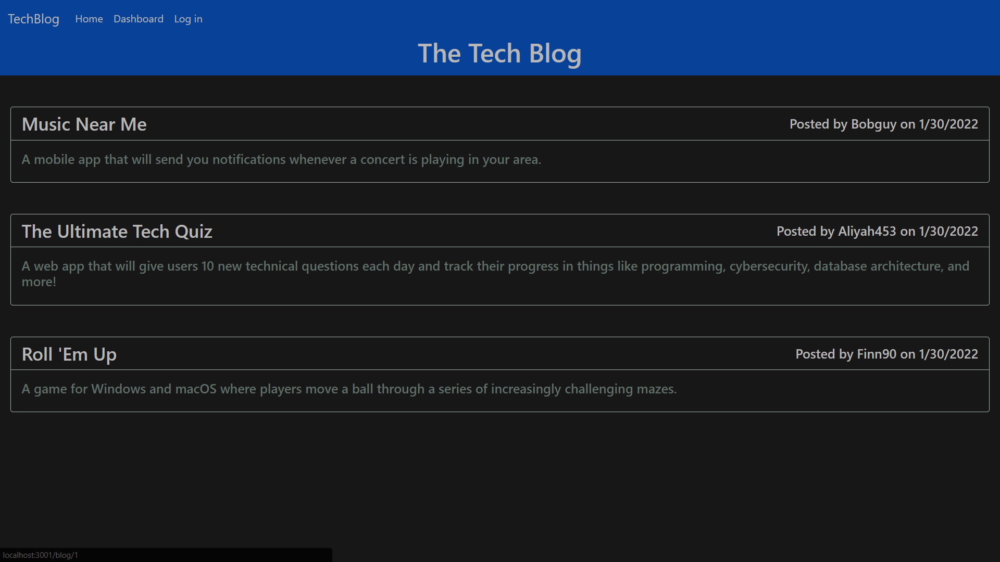
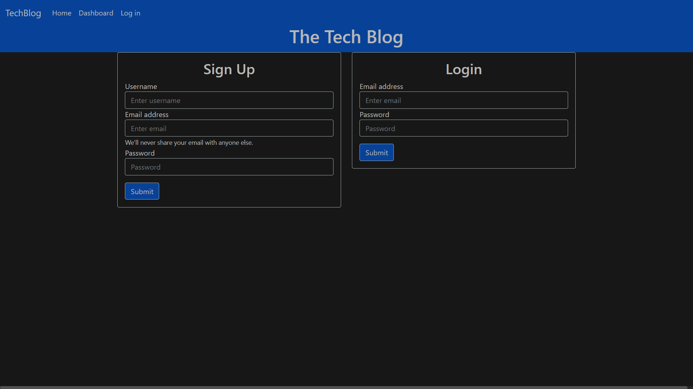
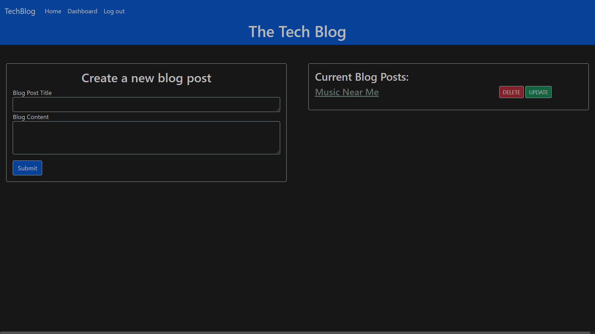
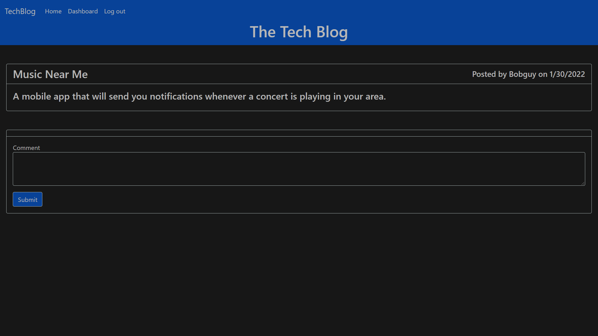

# Tech Blog
## Description
- This project involved building out a tech blog site from scratch and deploying it to Heroku.
- The tech blog is a place where users can create, update, and delete their own blog posts and comment on other user's posts.
- This app had me following the Model-Views-Controller paradigm, using Handlebars.js as the templating language, Sequelize as the ORM, and the express-session npm package for authentication.
- This app is my first introduction into building a full-stack website from scratch.
## Table of Contents
- [Installation](#installation)
- [Usage](#usage)
- [Credits](#credits)
- [License](#license)
- [Badges](#badges)
- [Tests](#tests)
## Installation
- N/A
## Usage
- Github Repo: https://github.com/jdomindev/tech-blog
- Deployed Link: https://secret-everglades-34739.herokuapp.com/
- Screenshots:
    
    
    
    
## Credits
- N/A
## License
MIT License

Copyright (c) 2022 Jose Dominguez

Permission is hereby granted, free of charge, to any person obtaining a copy of this software and associated documentation files (the "Software"), to deal in the Software without restriction, including without limitation the rights to use, copy, modify, merge, publish, distribute, sublicense, and/or sell copies of the Software, and to permit persons to whom the Software is furnished to do so, subject to the following conditions:

The above copyright notice and this permission notice shall be included in all copies or substantial portions of the Software.

THE SOFTWARE IS PROVIDED "AS IS", WITHOUT WARRANTY OF ANY KIND, EXPRESS OR IMPLIED, INCLUDING BUT NOT LIMITED TO THE WARRANTIES OF MERCHANTABILITY, FITNESS FOR A PARTICULAR PURPOSE AND NONINFRINGEMENT. IN NO EVENT SHALL THE AUTHORS OR COPYRIGHT HOLDERS BE LIABLE FOR ANY CLAIM, DAMAGES OR OTHER LIABILITY, WHETHER IN AN ACTION OF CONTRACT, TORT OR OTHERWISE, ARISING FROM, OUT OF OR IN CONNECTION WITH THE SOFTWARE OR THE USE OR OTHER DEALINGS IN THE SOFTWARE.
## Badges

## Tests
- N/A